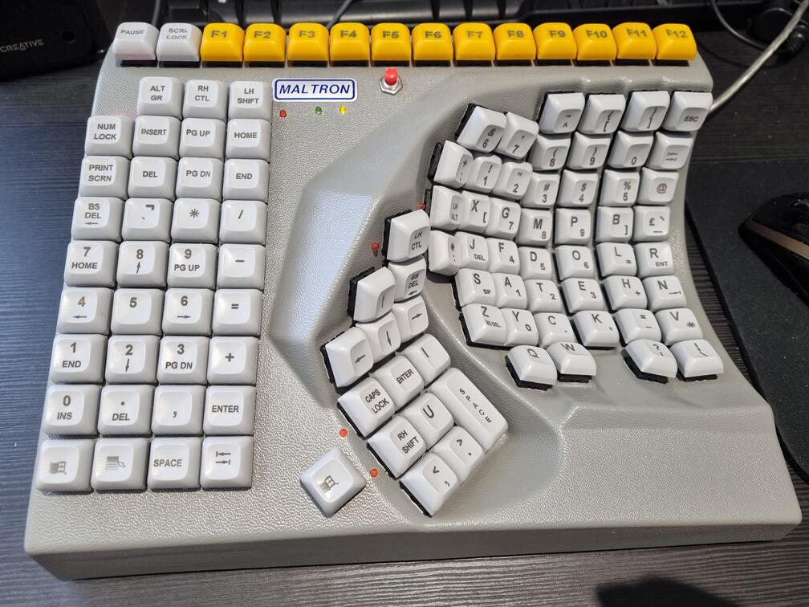
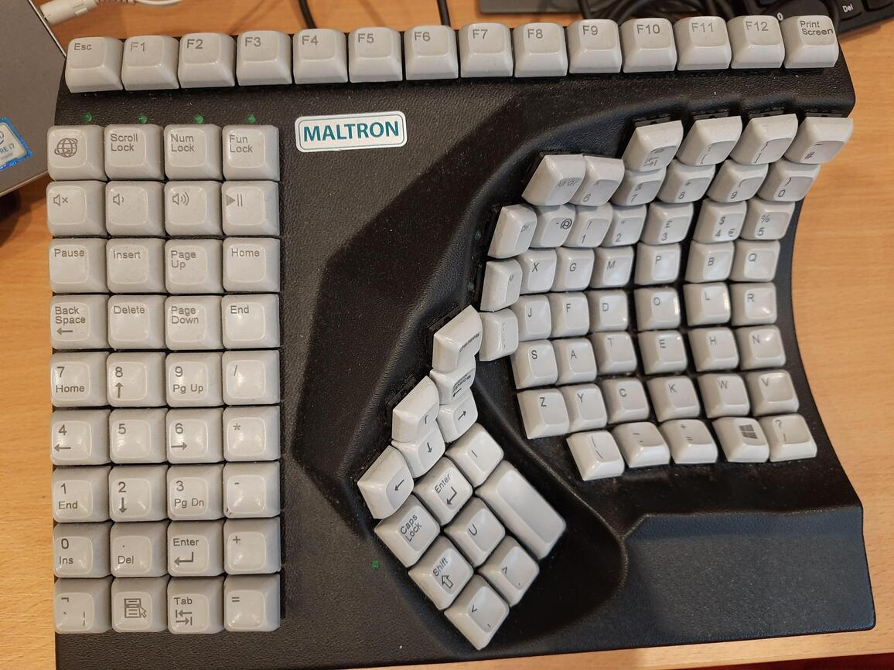
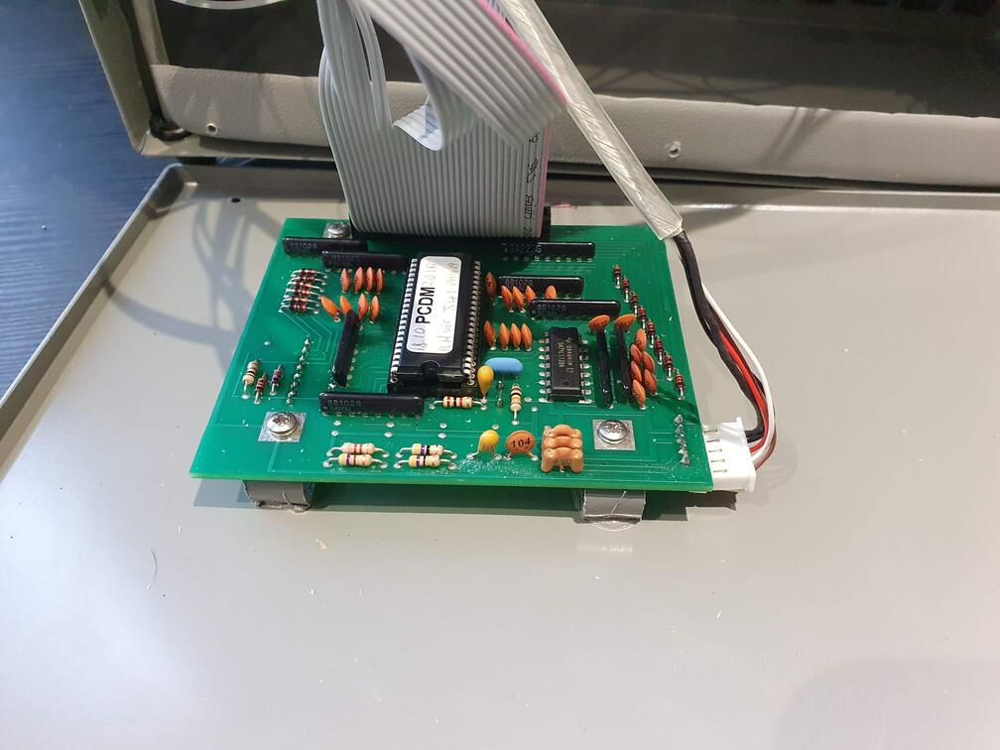
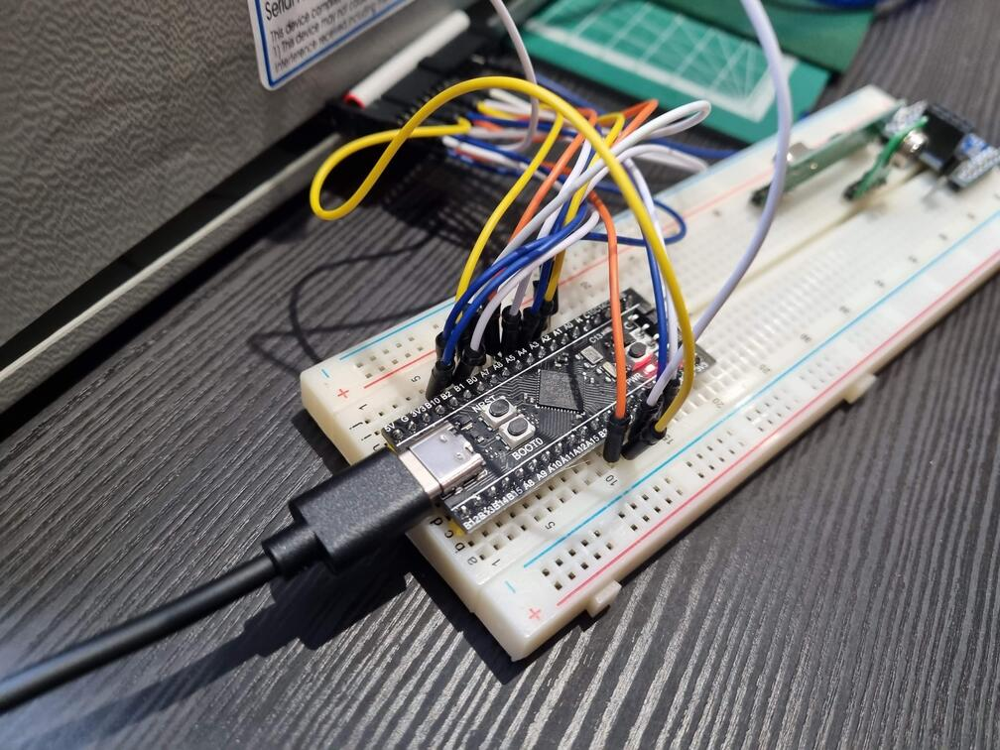
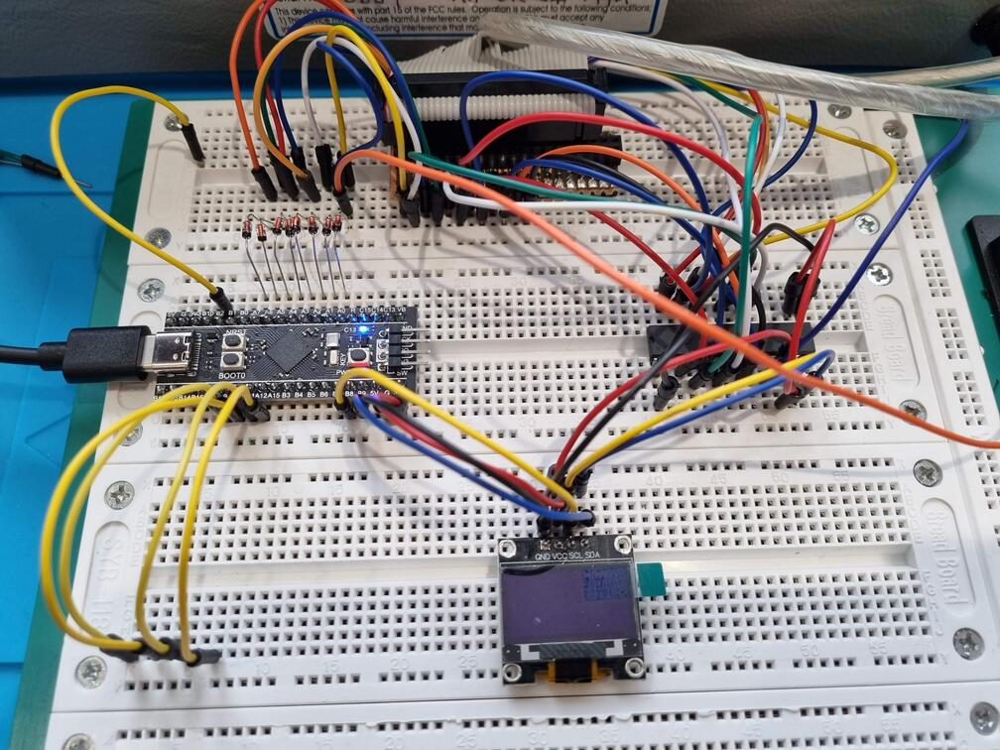
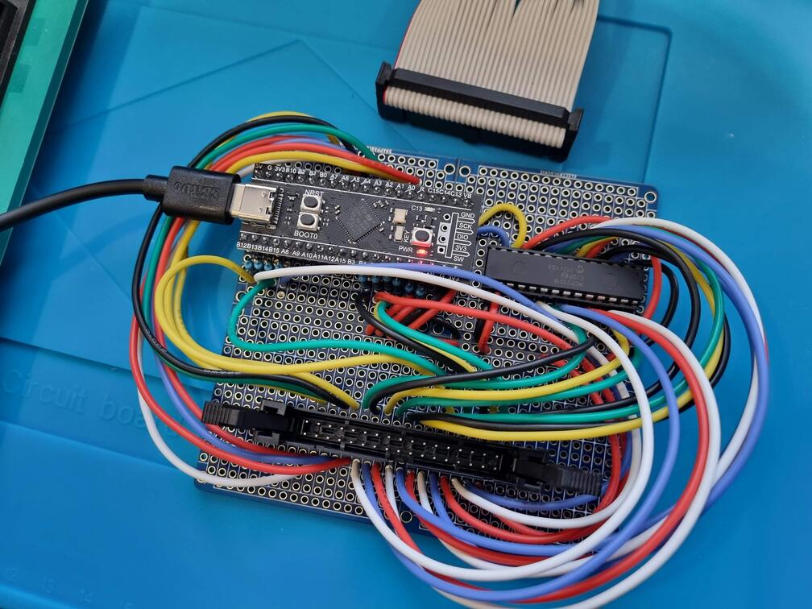
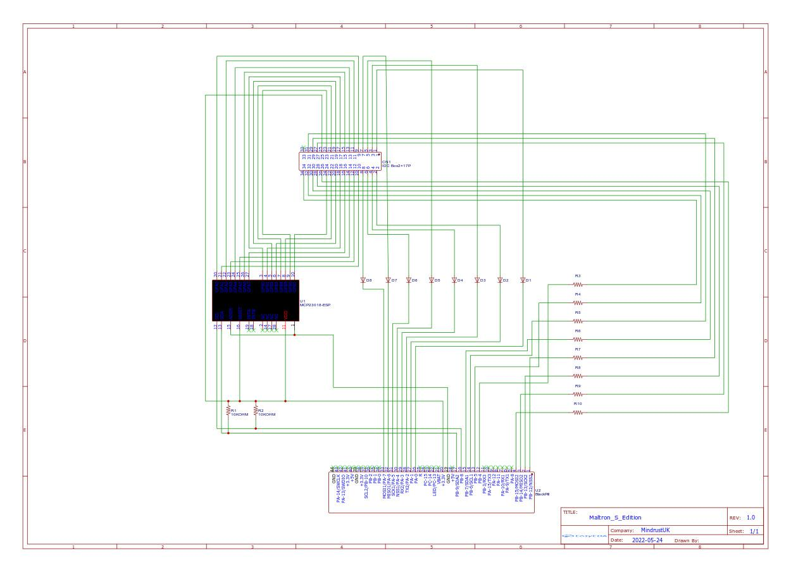
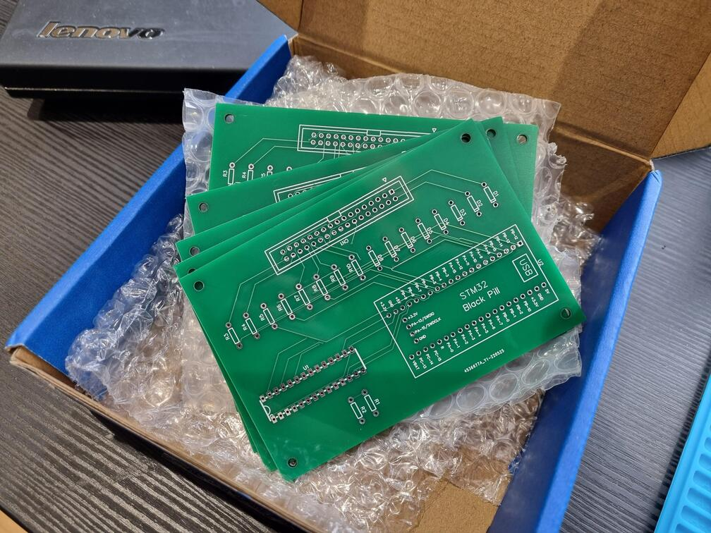
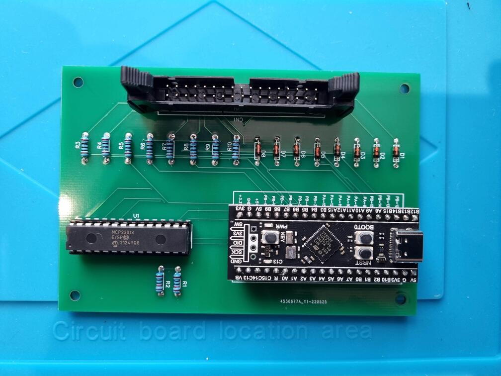
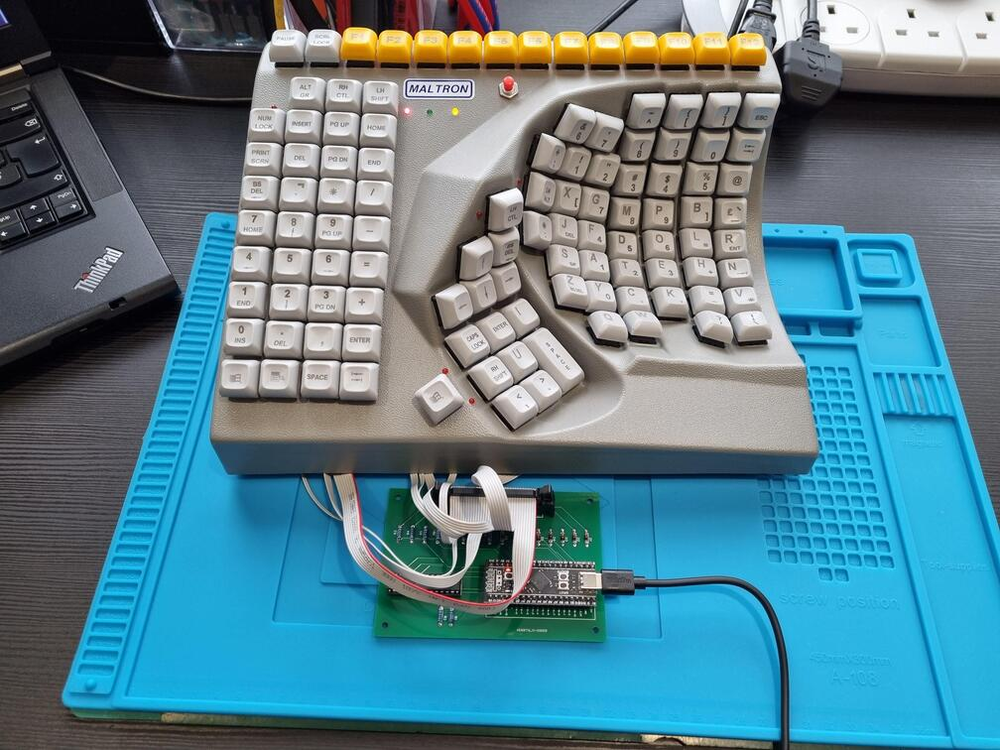

# Maltron - S Edition - The history

This project started when a hemiplegic user with a few different versions / variants of the Maltron Single handed 
(right side) keyboard, was having trouble with slightly different layouts across the keyboards they used at various
sites.

Some of these were the current (as of time of writing) keyboards sold by Maltron, Others were older PS/2 style units.

The user wanted to achieve as close parity between all units in terms of the keyboard's layout. To this end, the older
PS/2 Keyboards would be converted to USB using the [QMK Firmware](https://qmk.fm/) to cover many of the features (sticky
keys, layers etc.) that were built into these units.  This would also mean the keymap could be changed to bring them
into line with the current layout for the keyboard found here:
[https://www.maltron.com/united-kingdom.html](https://www.maltron.com/united-kingdom.html), specifically the
**RS10N1X-UK** model.

When asking for assistance on Reddit in understanding how QMK worked with IO Expanders, a user asked that I document the
process, and thus this repository was created.

This repository contains the following materials:
- Docuemtnation on the process
- Circuit Diagrams
- Gerber files
- Easy EDA files
- The Maltron S Edition specific files for generating a compatible QMK Firmware.

A comparison of two of the keyboard types can be seen in the following pictures:

## The process

The first step was to understand the anatomy of they device, on the PS/2 units that I'd be working on some searching
revealed the matrix in use was an 8 row, 16 column matrix, further use of a multi meter and physical inspection showed
8 leds in use with 8 diodes on the rows for anti ghosting.

As I wasn't confident at this stage and wanted a back out plan before committing I decided to remove the factory IDC
transition connector and replace it with a 34 pin IDC connector allowing for controller replacements in the future along
with easy prototyping and most of all a way to roll back if anything proved to be beyond reasonable.

The next step was to select a controller and start experimenting. I had faith in the QMK project as I had a friend who
had been raving about his custom-built keyboards for a while. I had 32 pins worth of Input / Output to deal with.
The larger Teensy series controllers proved expensive and hard to source in the UK and also offered less I/O than
competitors. The Raspberry Pi Pico was also evaluated and passed on for reasons I can't quite remember. I then found the
STM 32 - Black Pill module. This had USB-C, plenty of I/O, loads of memory and more than enough CPU power and
importantly was supported by qmk. However, I would shortly find out much of the I/O was unusable.

Early test with the QMK firmware was to build the simplest keyboard possible and get the matrix running. I managed to
get all rows and columns working and then started getting strange behaviour as I expanded, such as the controller not
starting, Errors with flashing and so on. I discovered after more study of documentation and searching Reddit that;
pins A9, A11 and A12 are all attached to USB, A10 can be used as an input but requires a pull-up resistor and B2 is a
reserved for use in the bootloader functionality. After some research and understanding the attributes of each of these
pins I realised no matter what I did on this module, I'd have to add an I/O expander.

The I2C bus is well known and widely supported, also thanks to some friendly pointers on Reddit and investigating the
Ergodox keyboard documentation and QMK Firmware, I found that the Microchip MCP23018 would fit my use case.

The next challenge would be software, thankfully I got lucky and during my prototyping, the QMK project matured and the
I2C support for the MCP23018 became natively available. I also found someone who had ported their version of the
firmware to the native driver:
[ergodone](https://github.com/zvecr/qmk_firmware/blob/feature/ergodone_ctpc/keyboards/ktec/ergodone/matrix.c)
I also added a SSD1306 OLED to the project as a temporary measure to give me some easy visual output as I continued 
work on getting the I2C support added. After coming to understand the firmware, adding debugging and generally maturing
the project, I removed the OLED support. This could be added back at anytime should anyone desire it.

I now had an I2C expander on all the columns of the keyboard, the LEDs and rows being driven from the STM32 Black Pill
controller and a basic keymap working. I now moved from Breadboard Development to a Soldered Prototype.

After an evening with the soldering iron I had a prototype version of the controller. More revisions of the software, 
more tweaking, getting sticky keys working, and adding layer support was done. Shortly after this process it was time to
move to the "production" version of the design. And after an amazingly quick session in [EasyEDA](https://easyeda.com/),
I had the following diagram:

I then ordered five prints of the board from [JLC PCB](https://jlcpcb.com/) exporting from EasyEDA straight into their
PCB CAD software, the boards arrived SUPER quickly as below:

Some assembly later and I had the following:

A quick test and everything works as expected. After testing and reviewing with the user, they wanted to purchase key 
caps from Maltron to match up the available keys in the closest possible way.

The next few jobs were a bit of 3d printing; to provide new stand-offs, seal up holes in the original unit and to
provide a re-enforcement where required. A USB-C panel mount connector was also added to keep everything socket and
modular for easy maintenance. This also helped the user as having a removable cable is a great benefit for them when
traveling and having to fit the Keyboard into luggage.

And finally a shot of testing before final assembly.

